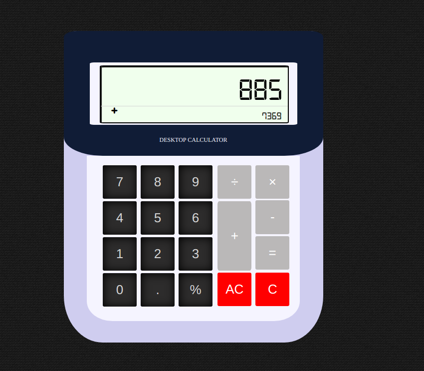

freeCodeCamp  Javascript Calulator
-----------------------------------

Through this challenge I created a simple calculator.

User stories that are challenge requirements:
 
**User Story**: I can add, subtract, multiply and divide two numbers.

**User Story**: I can clear the input field with a clear button.

**User Story**: I can keep chaining mathematical operations together until I hit the equal button, and the calculator will tell me the correct output.

Here is a preview..

You can see code live in [Codepen](https://codepen.io/GeorgeLin/pen/YQrroM).

Keep coding,

George

