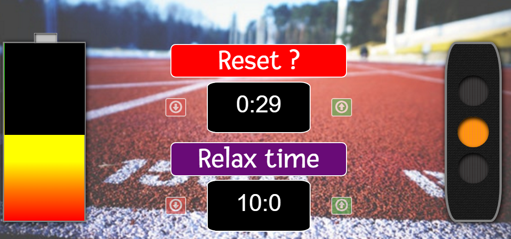

freeCodeCamp  Pomodoro clock
-----------------------------------

Through this challenge I created a pomodoro timer.

When working the battery gets empty and the traffic light warns you,
but when relaxing your battery gets fulled and traffic stays red! Enjoy.

User stories that are challenge requirements:
 
**User Story**: I can start a 25 minute pomodoro, and the timer will go off once 25 minutes has elapsed.

**User Story**: I can reset the clock for my next pomodoro.

**User Story**: I can customize the length of each pomodoro.

Here is a preview..

You can see code live in [Codepen](https://codepen.io/GeorgeLin/pen/MoOBGO).

In order to run correctly a file named "js/moment.js" is missing which is actually the moment.js library
Keep coding,

George
