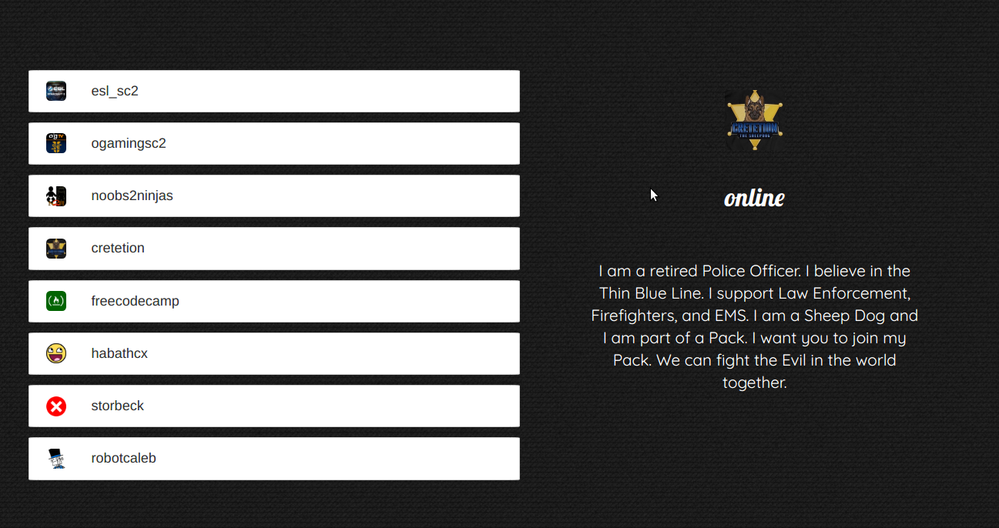

freeCodeCamp  twitchApi
-------------------------

Through this challenge I created a twitchTv Api.

You can see certain users status and some extra descriptions.

Here is a preview..

You can the twitchTv code live in [Codepen](https://codepen.io/GeorgeLin/pen/awyOyG).

Keep coding,

George

