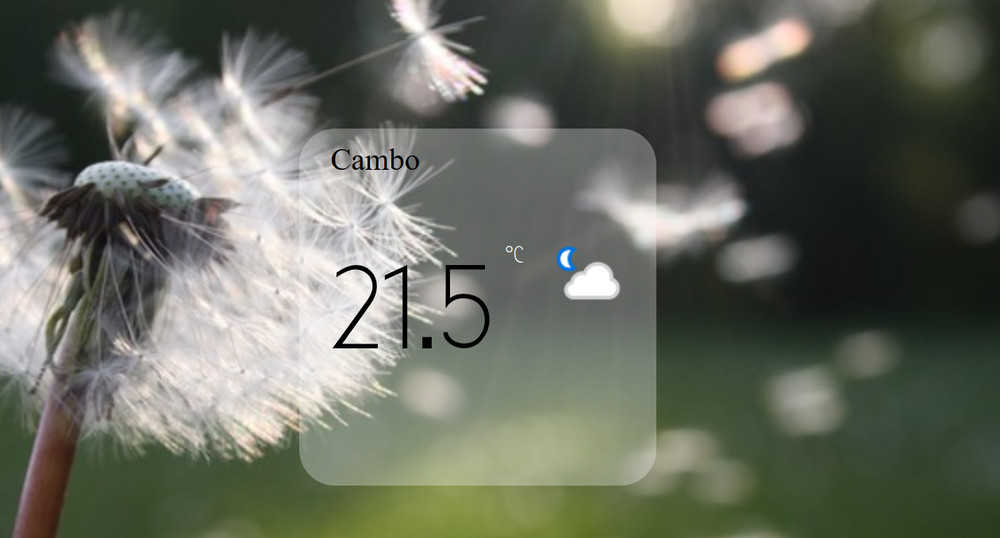

freeCodeCamp Weather app
-----------------------

This app gets your position through geolocator and show the temperature based on your location.

Background images change based on weather description.

Here is a preview..

Images are taken from [Pexels.com](https://www.pexels.com/).
Weather data are generated from [Apixu.com](https://www.apixu.com/).

You can the apps code live in [Codepen](https://codepen.io/GeorgeLin/pen/RgWYYY).

Keep coding,

George

