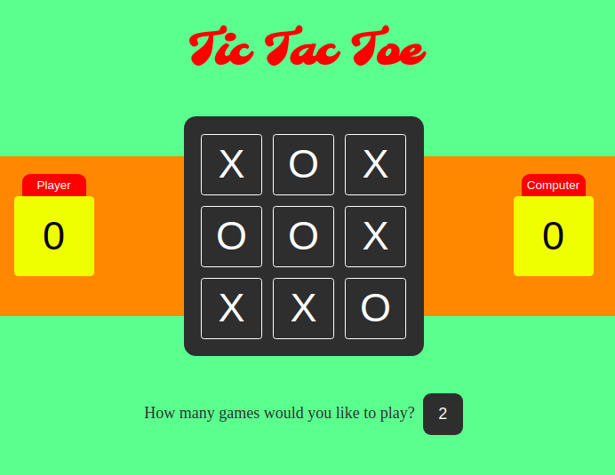

freeCodeCamp Challenges
-----------------------

This repository contains my solutions for freeCodeCamps algorithms.

I uploaded them in order to monitor my progress and of course be able to search for them if needed.

Please feel free to take a look but take into consideration the fact that these solutions

are not the only ones for each algorithm.

As always in coding and in every problem in life, there is never only one solution!

## Front-End Developer certification progress ##

HTML5 and CSS (5 hours)
- [x] Responsive Design with Bootstrap (5 hours)
- [x] Gear up for Success (20 minutes)
- [x] jQuery (3 hours)
- [x] Basic Front End Development Projects (50 hours)
- [x] Basic JavaScript (10 hours)
- [x] Object Oriented and Functional Programming (2 hours)
- [x] Basic Algorithm Scripting (50 hours)
- [x] JSON APIs and Ajax (2 hours)
- [x] Intermediate Front End Development Projects (100 hours)  
- [x] Intermediate Algorithm Scripting(50 hours)
- [ ] Advanced Front End Development Projects(150 hours)
    - [x] Build a JavaScript Calculator  
    - [x] Build a Pomodoro Clock   
    - [ ] Build a Tic Tac Toe Game Incomplete  (under development)  
    - [ ] Build a Simon Game Incomplete   

- [ ] Claim Your Front End Development Certificate

## Last project - Tic Tac Toe Game ##

